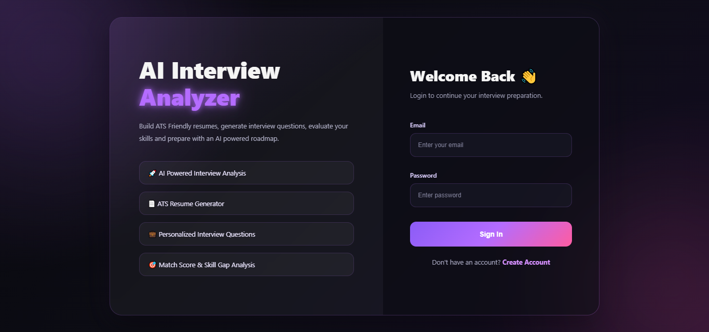
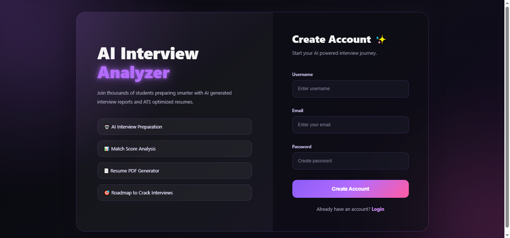
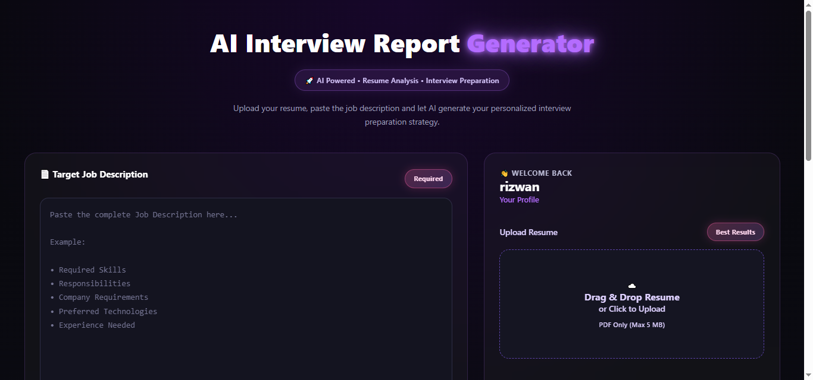
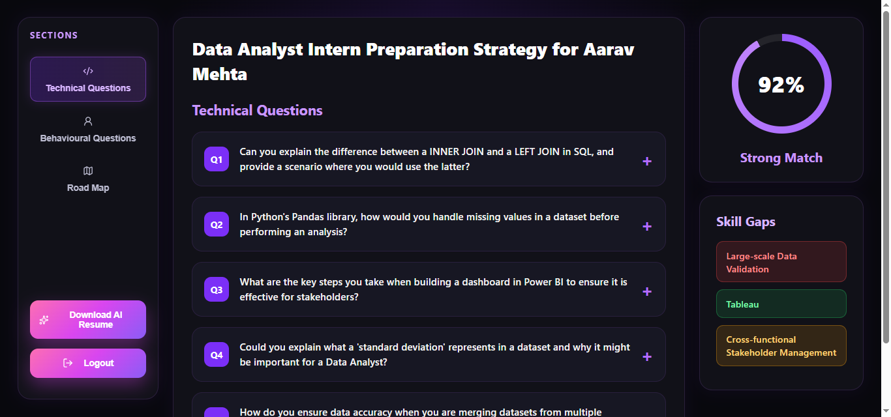
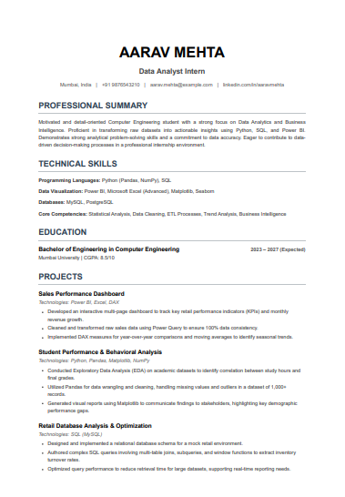

# 🤖 AI Interview Analyzer

An AI-powered Interview Preparation Platform that helps candidates analyze their resume against a target job description, generate personalized interview questions, identify skill gaps, create a preparation roadmap, and download an ATS-friendly AI-generated resume.

---

## 🚀 Live Demo

> Coming Soon...

---

## ✨ Features

* 🔐 Secure User Authentication (Register/Login/Logout)
* 📄 Upload Resume (PDF)
* 🤖 AI-powered Interview Report Generation
* 🎯 Resume vs Job Description Match Score
* 💻 Technical Interview Questions with Model Answers
* 🧠 Behavioural Interview Questions
* 📈 Personalized Skill Gap Analysis
* 🗓 7-Day Interview Preparation Roadmap
* 📑 AI Resume Generator (Download as PDF)
* 🎨 Modern Black + Purple Glassmorphism UI
* 🍪 JWT Authentication using HTTP-only Cookies
* 📱 Responsive Design

---

# 🛠 Tech Stack

### Frontend

* React.js
* Vite
* SCSS
* Axios
* React Router
* Lucide React
* Sonner Toast

### Backend

* Node.js
* Express.js
* MongoDB
* Mongoose
* JWT Authentication
* Multer
* Puppeteer
* Google Gemini AI API

---

# 🤖 AI Features

The application uses **Google Gemini AI** to generate:

* Resume Match Score
* Technical Interview Questions
* Behavioural Interview Questions
* Skill Gap Analysis
* Personalized Preparation Plan
* ATS Optimized Resume PDF

---

# 📂 Project Structure

```
AI-Interview-Analyzer/

│
├── Backend/
│   ├── src/
│   │   ├── controllers/
│   │   ├── routes/
│   │   ├── middlewares/
│   │   ├── services/
│   │   ├── models/
│   │   └── config/
│   │
│   ├── package.json
│   └── server.js
│
├── Frontend/
│   ├── src/
│   │   ├── features/
│   │   ├── pages/
│   │   ├── hooks/
│   │   ├── services/
│   │   └── styles/
│   │
│   └── package.json
│
└── README.md
```

---

# ⚙ Installation

## Clone Repository

```bash
git clone https://github.com/Huzaifa243/AI-Interview-Analyzer
```

---

## Backend

```bash
cd Backend
npm install
npx nodemon server.js
```

---

## Frontend

```bash
cd Frontend
npm install
npm run dev
```

---

# 🔑 Environment Variables

Create a `.env` file inside the **Backend** folder.

```
PORT=3000

MONGODB_URI=your_mongodb_connection

JWT_SECRET=your_secret_key

GOOGLE_GENAI_API_KEY=your_gemini_api_key
```

---

# 📸 Screenshots

## Login Page



---

## Register Page



---

## Home Dashboard



---

## Interview Report



---

## AI Resume Download



---

# 📌 Future Improvements

* Mock Interview using Voice AI
* AI Career Suggestions
* Interview History Dashboard
* Company-wise Interview Questions
* Dark / Light Theme
* Multi-language Support

---

# 👨‍💻 Author

**Huzaifa Khan**

Computer Engineering Student

---

# ⭐ Support

If you found this project useful, consider giving it a ⭐ on GitHub.
